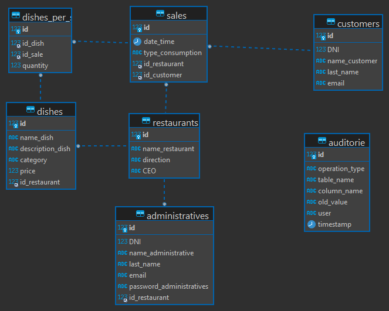

# 43410_TomasCueva
---
El presente repositorio es parte de mi proyecto final del curso de SQL de Coderhouse.

## Contenido
Dentro del repositorio, se encontraran las siguiente carpetas y directorios:
* `RestAnalytics/`: Directorio principal del proyecto:
    * `backup/`: Se encuentran los archivos de backups de tipo Dump Data and Structure, Dump Data Only y Dump Structure Only, junto con el script ejecutado para la creación de cada backup.
    * `csv/`: Se encuentran los archivos que contienen los datos para ser insertados en la base de datos mediante los comandos de bash que se encuentran en el directorio ./RestAnalytics/scripts/inserts/bash.
    * `design/`: Directorio con imagen del diagrama de entidad relación e información de la tematica propuesta para el proyecto.
    * `scripts/`: Directorio con todos los scripts para la creación de objetos(functions, stored_procedures, tables, triggers, users y views) e inserción de datos.
        * `inserts/`: Directorio con scripts `.sql` para la inserción de datos manual y `.sh` para la inserción de datos por importación, además del directorio `entities/` con scripts `.sql` para la inserción de datos manual para cada entidad. 
* `.env`: Archivo con variables de entorno para el contenedor
* `docker-compose.yml` : Archivo con configuración del contenedor.

## Creación del entorno
Recordar que se debe tener Docker instalado.

1. Agregar contraseña a la variable `MYSQL_ROOT_PASSWORD` del archivo `env`: 
```sh
MYSQL_ROOT_PASSWORD=...
MYSQL_USER_1=CuevaTomas
MYSQL_PASSWORD_1=TomasteawitaProyecta2002!
MYSQL_USER_2=AgustinCastillo
MYSQL_PASSWORD_2=Capy78f8d76@e112@@
...
```
2. Nos posicionamos a la misma altura que el archivo docker-compose.yml y creamos el directorio `data/`:
```bash
mkdir data
```
3. Luego corremos el contenedor:
```bash
 docker-compose up --build
```
4. Luego nos conectamos a la base de datos con nuestra herramienta de administración de bases de datos (por ejemplo DBeaver) con los siguientes datos:
    * `Host` : localhost
    * `Port` : 3306
    * `User` : root
    * `Password` : La ingresada en la variable `MYSQL_ROOT_PASSWORD`

¡IMPORTANTE!, si estás usando DBeaver, en la interfaz para crear una conexión, debes configurar la variable `allowedPublicKeyRetrieval` y ponerla en `true`. (No me preguntes porque, cualdo volví a ejecutar el proyecto hoy 28/11/2023 tube que hacer eso).

## Ejecución
En este apartado se indicaran los pasos recomendados para levantar la base de datos y la ejecuión de los scipts:
1. Creación de tablas y triggers utilizando las sentencias de los scripts `tables.sql` y `triggers.sql`.
2. Inserción de datos:
    * Por importación: Ejecutamos `docker exec -it mysql-coder mysql -uroot -p --local-infile=1` en la terminal e ingresamos la contraseña del usuario `root` cuando se nos indique. Posteriormente ejecutamos sentencia por sentencia que se encuentran alojadas dentro del script `./RestAnalytics/scripts/inserts/insercion.sh`. Recomendación: Si no te funciona el `ctrl+c` y `ctrl+c`, copia la sentencia que necesites y haz click derecho sobre la terminal. Cada sentencia debe ser ejecutada en el orden que se presenta dentro del script `insercion.sh`.
    * Inserción manual: Ejecuta el script `inserts.sql` para insertar todos los datos correspondientes a la base de datos o ejecutar los scripts que se encuentran dentro de la carpeta `èntities/` en el siguiente orden:
        1. `restaurants.sql`
        2. `customers.sql`
        3. `dishes.sql`
        4. `sales.sql`
        5. `dishes_per_sale.sql`
        6. `administratives.sql`
2. Creacion de objetos restantes:
    * `functions.sql`
    * `stored_procedures.sql`
    * `views.sql`
    * `users.sql`

## Diagrame ER
Si lograste ejecutar los pasos correctamente, el diagrama de entidad relación te debió quedar de la siguiente manera:



## Objetos
---
Dentro del directorio scripts de la carpeta RestAnalytics encontraremos las querys necesarias para la creacion de objetos e inserción de datos.

### functions
* FN_TOP_DISH_SELLING: Esta función devuelve el plato más vendido de un restaurante. recibe como parametro un numero entero, el debe ser un id de un restaurante.
* FN_TOTAL_REVENUE: Esta función devuelve el total recaudado en unidades monetarias de un día en especifico de un restaurante especifico. Recibe 4 parametros los cuales permiten numeros enteros.
    * restaurant: id de un restaurante.
    * day_selected: día del mes (1 hasta 31)
    * month_selected: mes del año (1 hasta 12)
    * year_selected: año en numeros enteros de 4 digitos 

### views
* VW_TOTAL_SALES_MOUNT: Monto total por cada venta registrada.
* VW_ORDERS_PER_CUSTOMER: Cantidad de ordenes por cliente.
* VW_TOTAL_COLLECTED_RESTAURANTS: Total facturado por restaurante a lo largo del tiempo.
* VW_ORDERS_BY_RESTAURANTS: Diferencia entre consusmo local y delivery por restaurante.
* VW_TOTAL_SPENT_PER_CUSTOMER: total gastado por cliente.

### stored_procedures
* SP_ORDER_TABLE: Ejecuta la consulta de una tabla ordenada a preferencia de acuerdo a un campo:
    * entity: tabla a aleccion.
    * field: campo a de la tabla.
    * order_value: solo acepta dos valores de tipo texto: "ASC" o "DESC"

* SP_ADD_RESTAURANT: Inserta un nuevo restaurante a la base de datos:
    * restaurant_name VARCHAR(75)
    * localization VARCHAR(75)
    * ceo VARCHAR(75)

* SP_GET_RESTAURANT_DISHES: Ejecuta una consulta para pedir los platos de un restaurante, solo recibe un parametro:
    * restaurant_id: id de un restaurante

### triggers
* TGR_AUDITORIE_DISHES: Al hacer un UPDATE de las columnas "price", "category" o "name_dish" de la tabla `dishes` se llenará la tabla de auditoria con los datos correspondientes a la tabla junto con el valor anterior de cada campo.

* TRG_AUDITORIE_CUSTOMERS: Antes de que se ejecute la acción delete dentro de la tabla customer, se llenaran los campos de la tabla auditoria con los datos correspondientes a la tabla junto con el id, DNI y apellido del customer eliminado de la tabla.